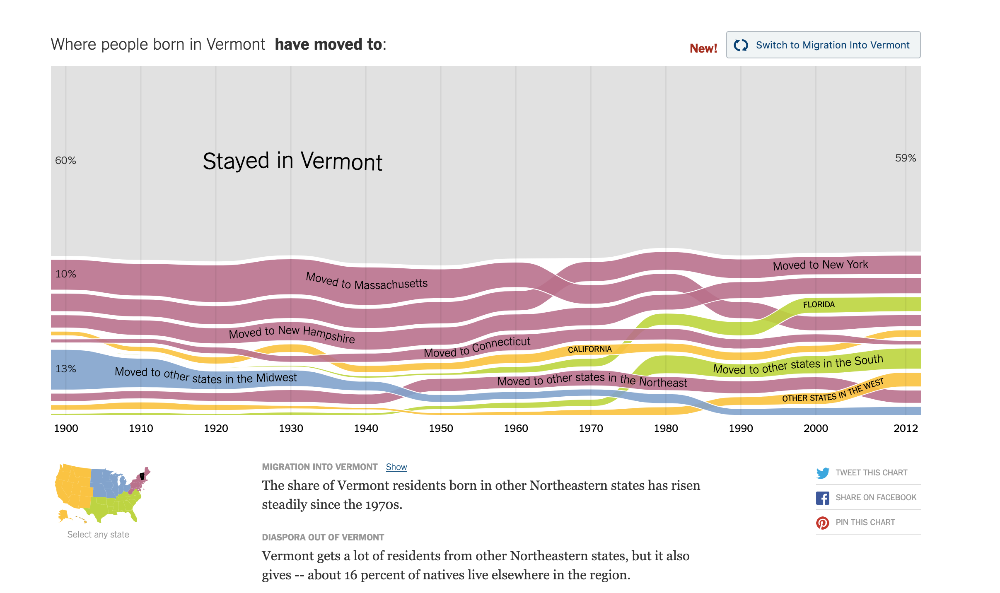
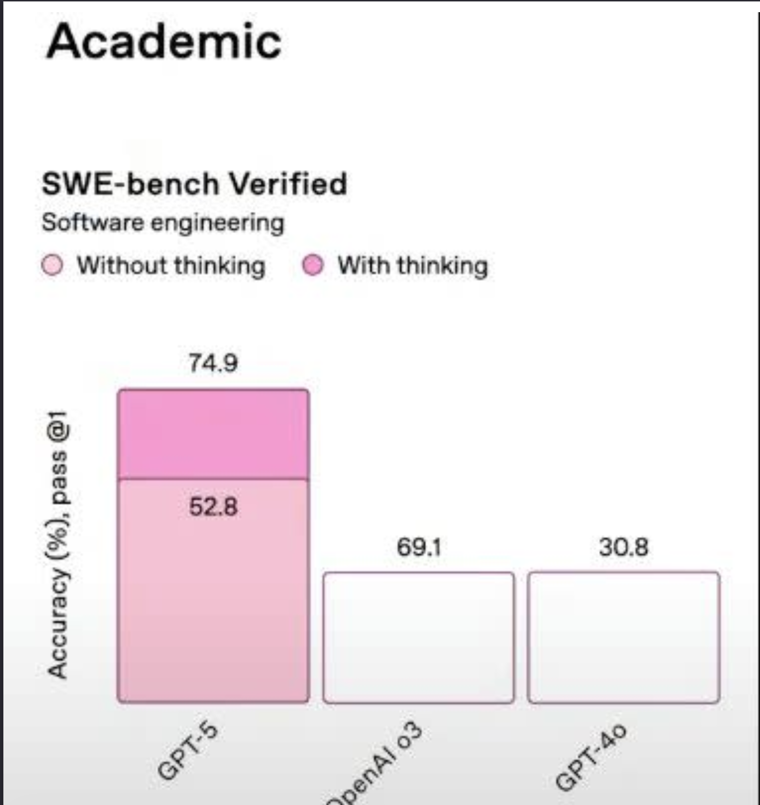
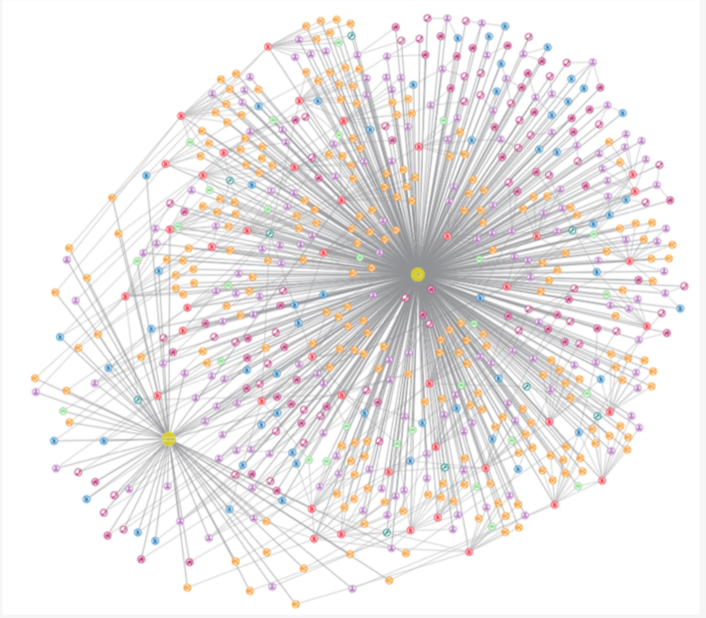

# Homework 1 - Good, Bad, and Ugly Visualizations

```yaml
name: Ryan Healy
userid: rah5ff
class: SARC 54000
semester: Spring 2026
```

## Required

1) Three visualizations / graphics.  Submit as an image file, screenshot, or link to an interactive visualization, with source citation (no particular format, just where you found this). Submit individually or as a compiled Word or PDF document, combined with (2) below.

2) A written paragraph or two about each, why you selected it, and what you think about it.  Explain what makes this visual successful, effective, good, ... or not.

[class assignment link](https://canvas.its.virginia.edu/courses/162865/assignments/816729)

## The Good

>the good — This will be a graphic which you consider to be among the best you have seen. It will be rich, well conceived, well designed, purposeful, and not only understandable, but revealing. Feel free to add other qualities, or to amend these.



[NyTimes UpShot link](https://www.nytimes.com/interactive/2014/08/13/upshot/where-people-in-each-state-were-born.html)
***

**Figure 1**: Migration by state

This screenshot is from a tool by the Upshot and NYtimes that shows the population movement in and out of various states over time.

There is real beauty in how this design allows the reader to discover new insights from each view allowing the reader to toggle between in flows and outflows of state populations over time.

I love how information rich the tool is without overloading the reader's senses. Migration groupings are clear, well bucketed, and the ribbons clearly separated. While the composition the movement ribbons out of the state of Vermont clearly changed over the last century the overall amount of "Vermonters" moving doesn't change that much. 


## The Bad
>the bad — A graphic which you consider to be among the worst — poor content, badly chosen design, no purpose or a purpose not well articulated, etc. With this graphic, you may be asking "what is this graphic about or even here for?"

***




[Yahoo Tech link](https://tech.yahoo.com/ai/articles/openais-performance-charts-gpt-5-143221747.html)

**Figure 2**: ChatGPT Bad Benchmarks

***

This was a pretty famous graphical mix up that come out in around some of the announcements from ChatGPT-5 results. The error made it into some of the materials shared and is far from the only bad public benchmark graphic. 

Looking at **Figure 2**, what makes this a bad visualization is how the distorted y-axis is and how the comparisons makes no sense.

The older models appear to have the same Accuracy pass measurements despite being vastly different from each other and the new model. At first glance the difference from the new model with thinking looks exponential instead of incremental. The model without thinking appears to work better than the older models despite having a lower accuracy.


## The Ugly
>the ugly — For this more interesting category, you will choose a visualization which could have been great, but isn't. This will be something with excellent potential — a great idea, an important issue or critical informational content, or just plain interesting — that either hasn't been carried out or was carried out poorly.


***




**Figure 3**: Ugly Network Analysis

This graph was from a page addressing the problems with "hairball" graphs. [Cambridge Intelligence link](https://cambridge-intelligence.com/how-to-fix-hairballs/)

Network Graphs are both incredibly useful and prone to fall for this "hairball" effect. These are technically correct but without the right layout or careful planning lose their utility. It is easy to overload the nodes with colors and have the connections made by edges crowd out the actual clusters of information.

Given how valuable these data structures are for modeling, care is really needed in the visualization. By adjusting the sampling of the graph, the size of the edges and nodes, using transparency when needed, and adjusting the layout we can rearrange the technically correct network to help the readers make sense of connection patterns.