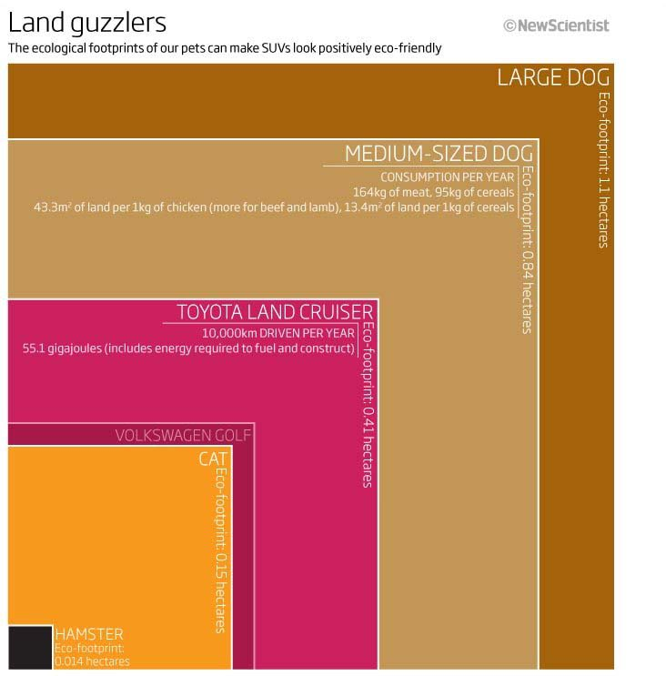

## Land guzzlers - Constructing Visual Order

* [Canvas Link](https://canvas.its.virginia.edu/courses/162865/assignments/816724)
* [starter observable notebook](https://observablehq.com/d/e5ae78bea3b99320)

Land guzzlers. The ecological footprints of our pets can make SUVs look positively eco-friendly.
[see the article Links to an external site.]

This is a lab-style exercise to help you to develop rules-based constructions of visual order, and to learn the syntax of D3.  This is learn-by-doing, to turn a novel graphical concept, through data, into a precise visual.

In D3/Observable, reproduce as best as you can, the "Land guzzlers" visual from Good.is, covering a New Scientist article Links to an external site. on ecological footprints, from a data file.  

Here is Landguzzlers JPEG to reference .
Here is the data with the numbers, for reference.
Concept:

There is a very precise concept to this visual, though it is a little novel, and that's the point.  The graphic objects and their sizes, positions, and relationships are structured (designed with intention) to construct a comparison.  The visual uses precise structural order to build this comparison, and to convey meaning.

So what is that structure?  What are the rules?  How do we implement them?  How do we turn data (numbers) into graphical order, but not just a scatter, bar, or line?  

For this visual you have 6 data records.  For others down the line, you'll have 6,000 or 6,000,000 records.  You need ordered rules (instructions) that put something somewhere based on the data.

This entire visual can be built from one set of numbers: the ecological footprint (in hectares).  These are the rectangles' square area.  And then everything else flows from that.

 

sketch of the organizational rules
First some rules:

We'll do this part in class, as part of an in-class demonstration / exercise.

    How do these objects find their location, size, etc.?  
    What are the instructions for how to draw them?  Build formulas and pseudo-code.
    What graphical properties are common (all objects of some type get some value)?  

 
Then write code (instructions):

We will start this in-class, then you'll finish it out on your own.  Please ask questions and come for help if you need.  This may not be obvious at first, but once you get the structure, it should start to make sense.

    Create a new Observable Links to an external site. notebook (Simple SVG is a good place to start).
    Attach the data file Download data file and insert it.
    Look at the helpful hints below.
    Then start building.

Refer to the copy/paste D3 code block templates Links to an external site. that I've created to see and use the main code chunks.

Everything (almost) can be built from one column: footprint.  From this one value, you can build:

    Rectangle width and height (as .attr() attributes)
    Rectangle x and y position (as .attr() attributes)
    Text x and y position attributes (hint: use text-anchor: end to get them to right-justify)
    color can come from a lookup in an array, by index
    text size can be controlled by .class definitions to set common properties on many objects at once 

You do not need to get this perfect or even 100% complete.  If you can get D3 to create 80% of this, as calculated rules, then you have the idea.

    Start with the rectangles.  
    Get that first d3.selectAll().data().join().attr().attr().attr() statement to build those at the right size and in the right positions.  Set your "calculation_or_value" for each attribute based on the data or index (d,i).
    Add .titles (LARGE DOG, MEDIUM-SIZED DOG, ...) using a second d3.selectAll().data().join().attr().attr().attr().style() statement.
    then subtitles ...
    then rotated text ...

After you get the main stuff - that 80% or so - then as an extra challenge, see if you can override the quirks and exceptions (that pesky HAMSTER!), but if you can get the main rules (above) to work cleanly, you're getting this!

Just Try.  We learn by doing.

 

To Submit:

    Submit the URL to your Observable notebook.  Copy this from your web browser or from the Share button in Observable.  Make sure that your Observable notebook is Public Can view (unlisted) so we can see it.
